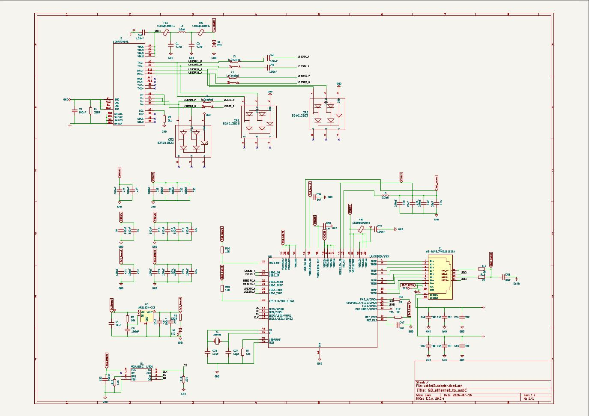
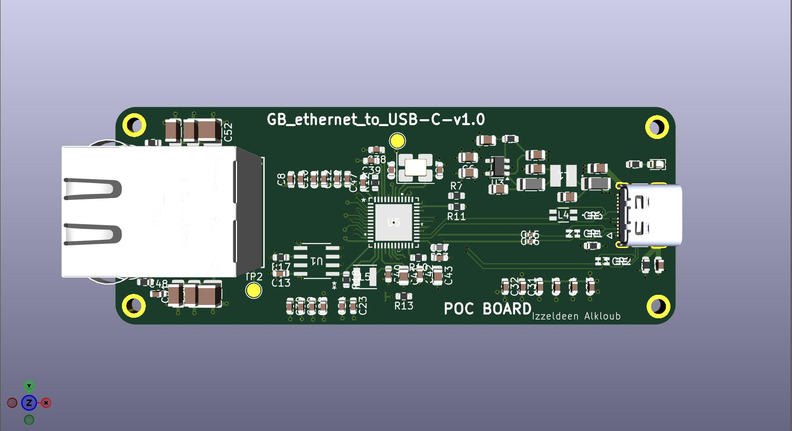

# HelloBoardPCB

A KiCad design project for a **USB-C to Gigabit Ethernet adapter** and my first complete 4-layer PCB layout.

## Project Purpose

This project was created as a proof of concept to practice:

- Four-layer PCB stack-up design
- USB-C connector integration
- Gigabit Ethernet routing and component placement
- Ground and power plane organization
- Differential-pair placement and routing
- KiCad schematic and PCB layout workflows

## Current Status

The schematic and initial PCB placement/routing have been completed.

However, this revision is **not production-ready** and has not been fabricated or electrically tested. Some Design Rule Check errors remain because the initial layout was completed before properly configuring:

- PCB manufacturer design constraints
- Net classes
- Differential-pair rules
- Track widths and clearances
- Via sizes
- Controlled-impedance requirements

The current revision should therefore be treated as a **layout study and proof-of-concept design**, rather than a validated manufacturing release.

A revised version with properly configured constraints, corrected DRC issues, and manufacturing files is planned.

## Current Schematic

## Current PCB Layout

## Planned Improvements

- Configure manufacturer-specific design rules
- Create dedicated USB 2.0, USB 3.x, Ethernet, power, and general-signal net classes
- Set appropriate differential-pair widths and spacing
- Review high-speed signal return paths
- Correct remaining ERC and DRC violations
- Review grounding and chassis/Earth connections
- Generate Gerber, drill, BOM, and pick-and-place files
- Perform a final manufacturability review

## Tools

- KiCad
- Four-layer PCB stack-up:
  - Front copper: components and signals
  - Inner layer 1: ground plane
  - Inner layer 2: power distribution
  - Back copper: signals

## Disclaimer

This repository currently documents my PCB design and learning process. The board should not be manufactured from the current files without completing a full electrical, mechanical, signal-integrity, and design-rule review.
